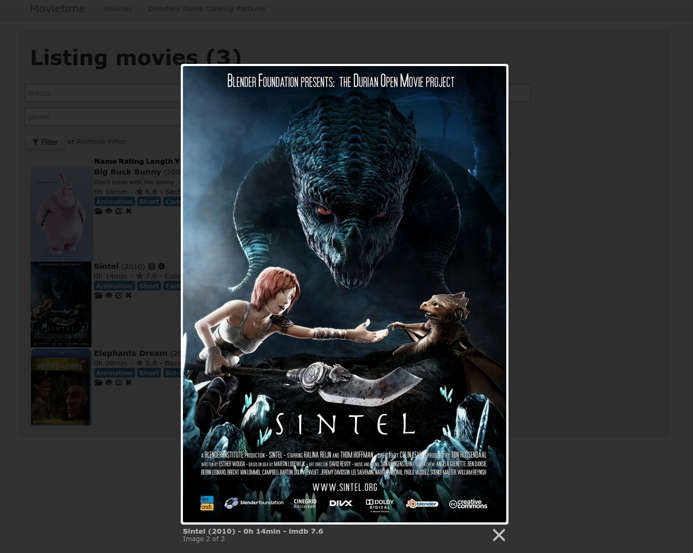

# Movietime
 
[Movietime](http://www.bekerle.com/Movietime) is a simple **personal movie database**, written in [Ruby on Rails](http://rubyonrails.org/). You can specify local directories that will be checked for movies and matched with metadata and a poster images from [IMDB](http://www.imdb.org).

Visit the project page here: [Movietime project page](http://www.bekerle.com/Movietime)

## Screenshots



## Features
- different movie folders (*Sources*) to scan for new movies with a *rake task* can be defined
- movie metadata and poster image can be fetched from [IMDB](http://www.imdb.org)
- you can search for directors, cast members, sources, genres and other text in your database
- you can specify the *end time* when filtering your movies, for example when you want to go to bed :)
- IMDB page and trailers on [YouTube](https://www.youtube.com/) are linked
- movies are taged with IMDB tags
- you can sort your search results by name, rating, movie length, year and creation date in your database

## Installation
You can either download the latest source here: [Movietime Source on GitHub as ZIP](https://github.com/pbek/movietime/archive/develop.zip)

Or you can checkout the code directly from the git repository:

```shell
git clone https://github.com/pbek/movietime.git -b develop
```

You will need [ruby](https://www.ruby-lang.org/en/downloads/) 1.9.3. So you can either visit the [ruby webpage](https://www.ruby-lang.org/en/downloads/) or use [railsinstaller](http://railsinstaller.org/en).

If you haven't installed the gem *bundle* do so:

```shell
cd movietime
sudo gem install bundle
```

then install all other gems with:

```shell
bundle install
```

If you are running into troubles with different ruby versions take a look at [rvm](https://rvm.io/). Install it and then do for example a:

```shell
rvm install ruby-1.9.3-p551
```

It should tell you to execute a line like this afterwards to use rvm, so don't forget to do that:

```shell
source ~/.rvm/scripts/rvm
```

Then run `bundle install` again to install all gems.

Now create the sqlite database with its tables and some data:

```shell
rake db:migrate
rake db:seed
```

Finally you can start your rails server:

```shell
rails s
```

It should tell you to open a webpage like this: <http://0.0.0.0:3000/>

Now click on [Sources](http://0.0.0.0:3000/sources) on the top and specify at least one directory where you store your movies (for example `/home/patbek/Videos` in my case). In this directory each movie has to have it's own directory.

## Scanning for new movies in your movie folders

To add your latest movies to the database you can run this script:

```shell
rake movies:update_database[auto]
```

It will scan your movie folders (*Sources*) and look up the movies on [IMDB](http://www.imdb.org) for you.

Don't forget, every movie has to have it's own directory, so that the scanner can search for it properly, for example like this:

```
Videos/
├── Big Buck Bunny
│   └── BigBuckBunny_320x180.mp4
├── Elephants Dream
│   └── ED_1024.avi
└── Sintel
    └── sintel-1024-stereo.mp4
```

You can specify some search & replace patterns for your folder names in the section [Directory Name Cleanup Patterns](http://0.0.0.0:3000/directory_name_cleanup_patterns) on the top.

## Disclaimer
This SOFTWARE PRODUCT is provided by THE PROVIDER "as is" and "with all faults." THE PROVIDER makes no representations or warranties of any kind concerning the safety, suitability, lack of viruses, inaccuracies, typographical errors, or other harmful components of this SOFTWARE PRODUCT. 

There are inherent dangers in the use of any software, and you are solely responsible for determining whether this SOFTWARE PRODUCT is compatible with your equipment and other software installed on your equipment. You are also solely responsible for the protection of your equipment and backup of your data, and THE PROVIDER will not be liable for any damages you may suffer in connection with using, modifying, or distributing this SOFTWARE PRODUCT.
